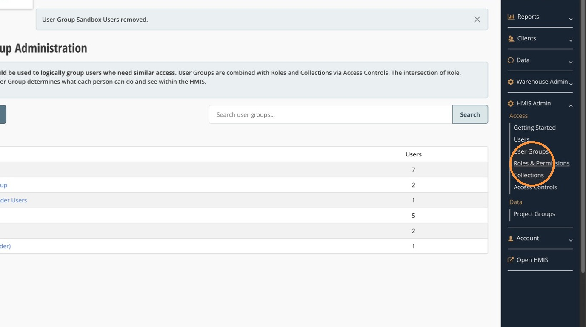
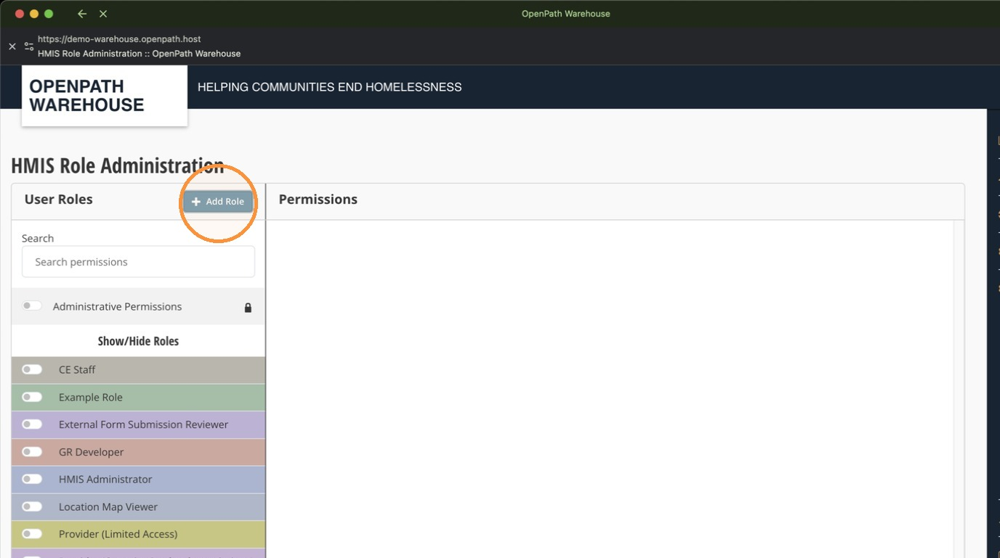

Roles determine what users can do in HMIS by grouping related permissions together. Permissions define the specific actions a role is allowed to perform, such as viewing client records, managing enrollments, running reports, or updating administrative settings.

> [[!NOTE]]
> Roles and permissions can also be established for Warehouse access. This configuration is located under **Warehouse Admin** and follows a similar process to the one described below.

## Open Roles and Permissions

1. Open **Admin** from the right navigation, then select **Roles and Permissions**.

## Create a Role

A role defines the responsibilities of a user by grouping together the permissions they need.

For example, a **Program Manager** role might allow users to view client records, manage enrollments, run reports, and update project information without granting full administrative access. A **Data Analyst** role might allow users to view reports and analyze project data without allowing them to edit client records, manage enrollments, or change system settings.

1. Click **Add New Role**.
2. Enter a role name, then click **Create Role**.

## Manage Role Permissions

Permissions define the specific actions a role can perform. Administrators select the tasks each role is allowed to complete, such as viewing client records, editing enrollments, managing users, running reports, or updating administrative settings.

Permissions are organized into groups so they're easier to review and compare across roles:

- Administration
- Client Access
- Client Files
- Enrollment Access
- Project Access
- Referrals

When configuring permissions, grant only the access the role needs. Following the principle of least privilege helps protect client data and reduces the chance of unintended changes.

1. Turn on the toggle for the role you want to edit.
2. Expand the permission group you want to edit (see the list above).
3. Select or clear the checkbox next to each permission you want to enable or disable.
4. Repeat for any additional permission groups that need to be updated.

## Hide Administrative Permissions

Use the **Admin Permissions** toggle to hide administrative permissions for roles that shouldn't have administrative access. This simplifies the permissions view and helps prevent administrative permissions from being assigned accidentally.

## Compare Roles

1. Turn on the toggle for each role you want to compare. The selected roles appear side by side in the permissions panel.
2. Expand the permission groups to review which permissions are enabled or disabled for each role, and make changes as needed.
3. When you've finished making changes, click **Save Changes** at the top of the permissions panel. A confirmation message appears after the permissions have been saved successfully.

Once a role exists, see [Manage Data Access Collections](manage-data-access-collections.md) to define what data it applies to, and [Manage Access Controls](manage-access-controls.md) to connect the two.
